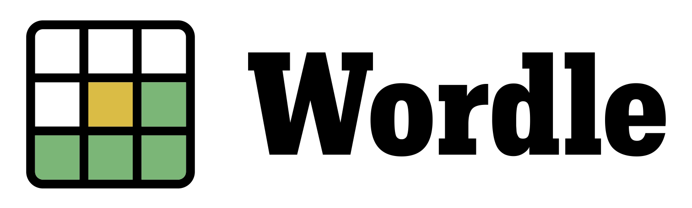

<!---
Original repl.it tends to be down
  
-->
    
   
   
   

<h1 align="center"> Hi, I'm Brian !
</h1>

Welcome to my page !  I'm a Fullstack developer from  <b>Paris, France</b>, currently living in  <b>Tokyo, Japan</b>. 

<h3>Things I code with</h3>

  
   
  
  
    
  
  
  
  
  
  
  
  
  
  
  
  
  
  

---

<h3 align="center">Tuneify</h3>
  

 Allow me to introduce my latest and most exciting project. Tuneify is all about making it easy and fun to share your current favorite tunes with your besties in real-time! Whether you're discovering new music or reminiscing with old classics, Tuneify lets you create personalized playlists and share them with your friends instantly. <a href="https://github.com/dcBrian/wordle"> 🎵 Check out the project on GitHub. </a>

---

  

 Ready to challenge your vocabulary and have some gaming fun? Look no further! Check out my exciting word game, Wordle! This captivating game will put your puzzle-solving skills to the test as you guess the secret five-letter word with limited attempts. <a href="https://github.com/dcBrian/wordle">Explore the code and give it a try here</a>. I hope you enjoy playing it as much as I enjoyed creating it! 🌟 

---

<h3 align="center">Partial Website Clones</h3>

I like to challenge myself by attempting to recreate some of the world's most famous websites's features. Here are a few partial website clones I've crafted:

  <table align="center"> 
    <tr>
      <th>Project</th>
      <th>Status</th>
    </tr>
    <tr>
      <td><a href="https://github.com/dcBrian/Airbnb">Airbnb</a></td>
      <td>Done</td>
    </tr>
    <tr>
      <td><a href="https://github.com/dcBrian/Reddit">Reddit</a></td>
      <td>Done</td>
    </tr>
  </table>

